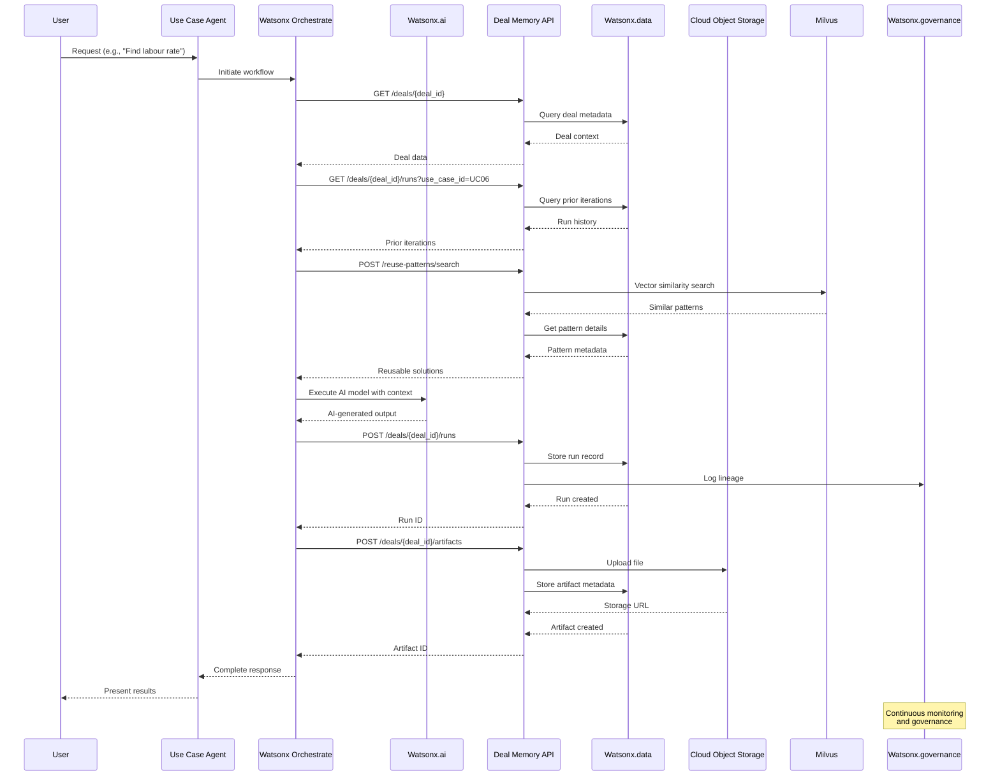
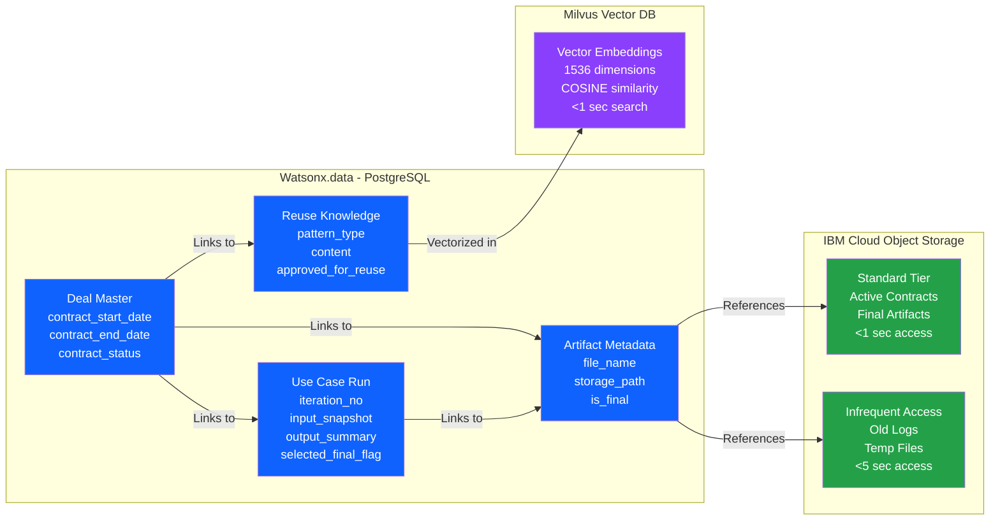
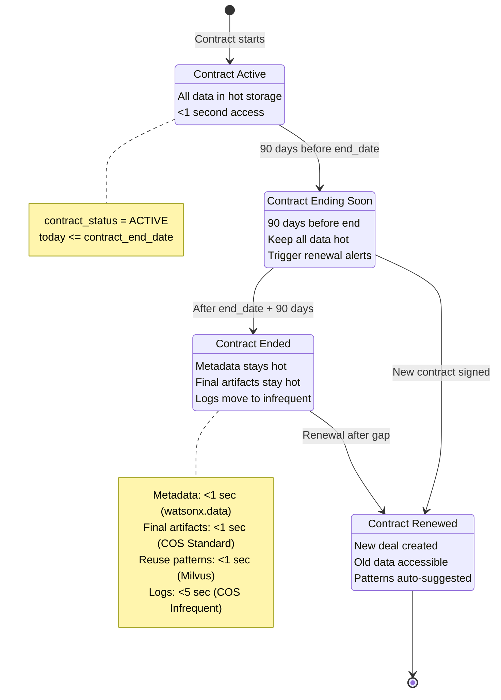
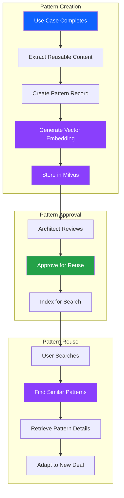
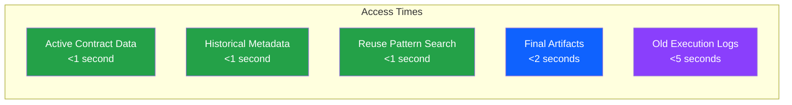

# Shared Deal Memory - Architecture Diagram

## High-Level Architecture with IBM Watsonx Products

```mermaid
graph TB
    subgraph "User Layer"
        U1[Sales Teams]
        U2[TSMs]
        U3[Delivery Teams]
        U4[Architects]
    end

    subgraph "AI Use Cases Layer"
        UC01[UC01: Process Guidance]
        UC02[UC02: Deal Portal Intake]
        UC03[UC03: Deal Classification]
        UC04[UC04: Solution Design Supervisor]
        UC06[UC06: Labour Rates]
        UC14[UC14: Service Design Costing]
        UC16[UC16: Deck Generation]
        UC17[UC17: Handover Documentation]
        UCX[... All 18 Use Cases]
    end

    subgraph "IBM Watsonx Orchestrate"
        WXO[Watsonx Orchestrate<br/>Agent Coordination & Workflows]
    end

    subgraph "IBM Watsonx.ai"
        WXA[Watsonx.ai<br/>Foundation Models<br/>Granite 13B Chat<br/>Prompt Execution]
    end

    subgraph "Shared Deal Memory API Layer"
        API[Deal Memory API<br/>Node.js/Python Service<br/>REST Endpoints]
        AUTH[IBM AppID<br/>OAuth 2.0<br/>Authentication]
    end

    subgraph "IBM Watsonx.data"
        WXD[(Watsonx.data<br/>PostgreSQL<br/>Structured Data)]
        DM[Deal Master<br/>Records]
        UCR[Use Case Run<br/>Records]
        ART[Artifact<br/>Metadata]
        RK[Reuse Knowledge<br/>Records]
    end

    subgraph "IBM Cloud Object Storage"
        COS1[COS Standard Tier<br/>Active Contracts<br/>Final Artifacts<br/>Reuse Patterns]
        COS2[COS Infrequent Access<br/>Old Logs<br/>Temporary Files]
    end

    subgraph "Milvus Vector Database"
        MIL[(Milvus<br/>Vector Embeddings<br/>1536 Dimensions)]
        VEC[Reuse Pattern<br/>Embeddings]
    end

    subgraph "IBM Watsonx.governance"
        WXG[Watsonx.governance<br/>AI Factsheets<br/>Lineage Tracking<br/>Monitoring<br/>Compliance]
    end

    subgraph "Monitoring & Operations"
        SYS[Sysdig<br/>Application Monitoring]
        PROM[Prometheus<br/>Infrastructure Metrics]
        LOG[IBM Cloud Logs<br/>Centralized Logging]
    end

    subgraph "External Systems"
        DP[Deal Portal]
        ISC[ISC]
        CONGA[Conga]
    end

    %% User to Use Cases
    U1 --> UC01
    U1 --> UC02
    U2 --> UC04
    U2 --> UC06
    U2 --> UC14
    U3 --> UC17
    U4 --> RK

    %% Use Cases to Orchestrate
    UC01 --> WXO
    UC02 --> WXO
    UC03 --> WXO
    UC04 --> WXO
    UC06 --> WXO
    UC14 --> WXO
    UC16 --> WXO
    UC17 --> WXO
    UCX --> WXO

    %% Orchestrate to AI and API
    WXO --> WXA
    WXO --> API

    %% API Authentication
    API --> AUTH

    %% API to Storage Layers
    API --> WXD
    API --> COS1
    API --> COS2
    API --> MIL

    %% Watsonx.data internal structure
    WXD --> DM
    WXD --> UCR
    WXD --> ART
    WXD --> RK

    %% Milvus internal
    MIL --> VEC

    %% Governance connections
    WXO -.-> WXG
    WXA -.-> WXG
    API -.-> WXG
    WXD -.-> WXG

    %% Monitoring connections
    API -.-> SYS
    WXD -.-> SYS
    API -.-> LOG
    WXO -.-> LOG

    %% External system connections
    DP --> API
    API --> ISC
    API --> CONGA

    %% Styling
    classDef watsonx fill:#0f62fe,stroke:#0f62fe,color:#fff
    classDef storage fill:#24a148,stroke:#24a148,color:#fff
    classDef api fill:#8a3ffc,stroke:#8a3ffc,color:#fff
    classDef monitoring fill:#fa4d56,stroke:#fa4d56,color:#fff
    classDef external fill:#f1c21b,stroke:#f1c21b,color:#000

    class WXO,WXA,WXG watsonx
    class WXD,COS1,COS2,MIL storage
    class API,AUTH api
    class SYS,PROM,LOG monitoring
    class DP,ISC,CONGA external
```

## Data Flow Diagram

## Storage Architecture Detail

## Contract-Driven Lifecycle

## Reuse Pattern Flow

## Technology Stack Summary

| Layer | IBM Product | Purpose | Performance |
|-------|-------------|---------|-------------|
| **Orchestration** | IBM Watsonx Orchestrate | Agent coordination, workflows | N/A |
| **AI Runtime** | IBM Watsonx.ai | Foundation models (Granite 13B) | <3 sec inference |
| **Structured Data** | IBM Watsonx.data (PostgreSQL) | Deal records, metadata | <1 sec queries |
| **File Storage** | IBM Cloud Object Storage | Artifacts, documents | <1 sec (Standard tier) |
| **Vector Search** | Milvus + Watsonx.data | Semantic similarity | <1 sec search |
| **Governance** | IBM Watsonx.governance | Lineage, compliance | Real-time |
| **Authentication** | IBM AppID | OAuth 2.0, SSO | <100ms |
| **Monitoring** | Sysdig + IBM Cloud Logs | Observability | Real-time |

## Key Architectural Decisions

1. **Watsonx.data as Primary Store**: All metadata stays in PostgreSQL forever for fast access
2. **COS Standard for Active Data**: Active contracts and final artifacts never archived
3. **Milvus for Semantic Search**: Vector embeddings enable finding similar solutions from any time period
4. **Watsonx.governance Integration**: Built-in lineage and compliance from day one
5. **Contract-Driven Lifecycle**: Retention based on business logic, not just age
6. **API-First Design**: All access through standardized API, no direct database access

## Performance Guarantees

---

**Document Version**: 1.0  
**Last Updated**: 2026-04-22  
**Related Documents**: 
- Shared Deal Memory Specification: `/02-Shared-Components/Shared-Deal-Memory-Specification.md`
- Architecture Overview: `/00-Overview/Architecture-Overview.md`